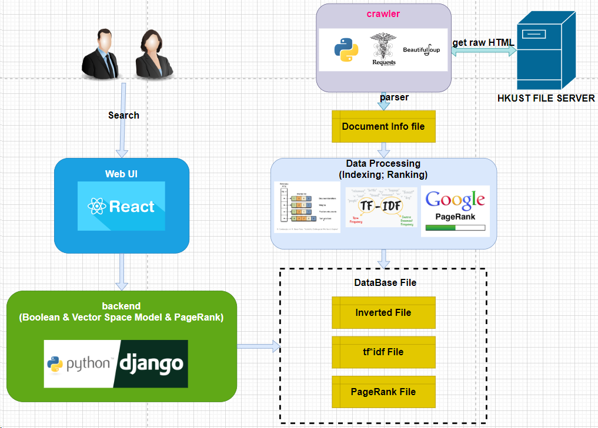

# SearchEngine
Repo of CSIT5930 course project



# Start Project
1. install python requirements
   ```
    pip install -r requirements.txt
   ```
2. start backend server
   ```
    cd backend
    python manage.py runserver
   ```
3. open `build/index.html` in browser to use our search engine
